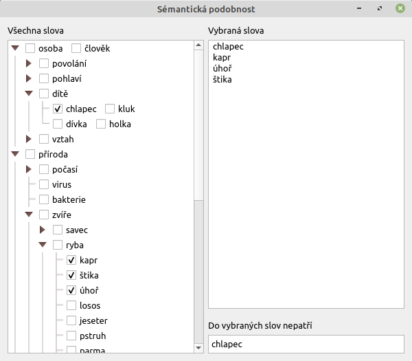

# Sémantická podobnost

Program umožňující najít slovo, které sémanticky nepatří do vybrané množiny slov, v českém jazyce.
Základem programu je ručně vyplněný systém sémantických podmnožin.

## Požadavky

- Qt5 (5.15.2+)
- cmake 3.17+

## Instalace

1. Vytvořit CMakeLists.txt: `cp CMakeLists.txt.dist CMakeLists.txt`
1. Nastavit cestu k instalaci Qt v CMakeLists.txt: `set(CMAKE_PREFIX_PATH "/PATH-TO-QT/qt5/5.15.2/gcc_64/lib/cmake")`
2. Konfigurace: `cmake -S . -B build`
3. Build: `cmake --build build`
4. Spuštění programu: `./build/semantic_similarity`

### GUI

## Popis funkčnosti

Každé slovo patří do několika nadmnožin, např. *kapr* patří postupně
do nadmnožin *ryba*, *zvíře* a *příroda*. Po výběru množiny slov (nejméně tři slova)
se porovná příslušnost do nadmožin pro každou dvojici vybraných slov.
Každé vybrané slovo tak dostane score jako číslo určující součet shodných nadmnožin
se všemi ostatními vybranými slovy.

Pokud je nejmenší score rovno maximálnímu score pro vybraná slova, nepatřící slovo neexistuje
(vybraná slova jsou všechna v jedné množině).
Pokud druhé nejmenší score je rovno nejmenšímu scóre, ale ne největšímu score, nepatřící slovo neexistuje
(dvě a více slov se stejným score nepatří do vybrané množiny a nelze mezi nimi rozlišit, které jedno
tam nepatří). 
Jinak slovo s nejmenším score je označeno jako nepatřící do množiny vybraných slov.

V případě, že jedno slovo je ve více množinách (např. *muž*) nebo se jedná o homonymum (např. *čočka*)
vybere se zařazení slova do té množiny, ve které má slovo nejvyšší score.

## Data

Základem pro data je frekvenční slovník českých podstatných jmen z publikace 
*A Frequency Dictionary of Czech: Core Vocabulary for Learners (František Čermák, Michal Křen)*.
Bylo vybráno tisíc podstatných jmen, která lze rozumně zařadit do nějaké kategorie.

## Srovnání s word embeddingem

Hlavní nevýhodou uvedeného přístupu je nutnost ručního vyplnění dat.
Výhodou je jednoduchost algoritmu, možnost brát v úvahu nejen slova ale i slovní spojení
a zajistit správné zařazení homonym. Tento přístup je také pravděpodobně blíže tomu,
jak se sémantickou podobností pracuje lidský mozek (nepřevádí slova na číselné vektory).

Výhodou word embeddingu je automatické zpracování datového korpusu.
Kromě výše zmíněných nevýhod je třeba mít také k dispozici rozsáhlý jazykový korpus.